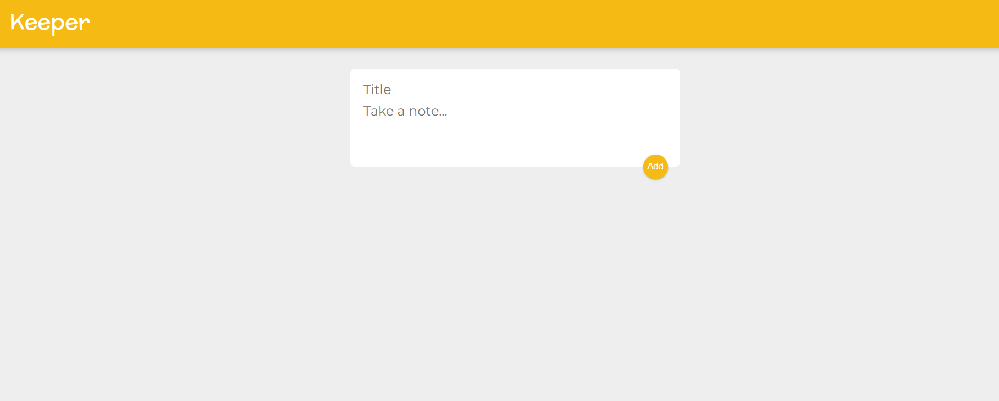
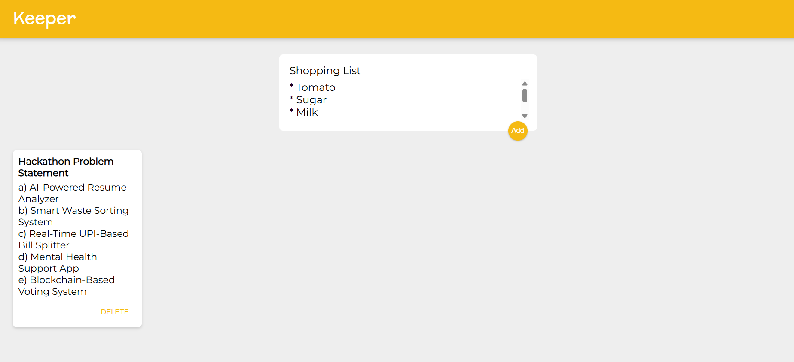
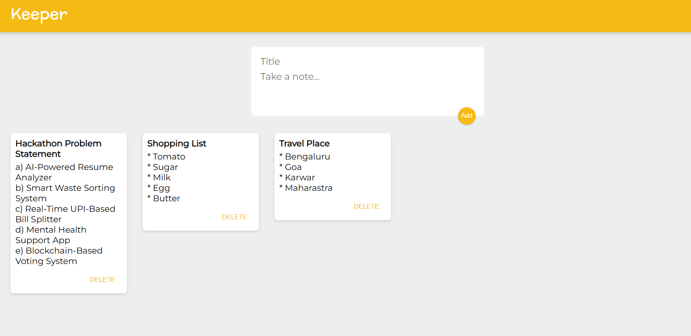
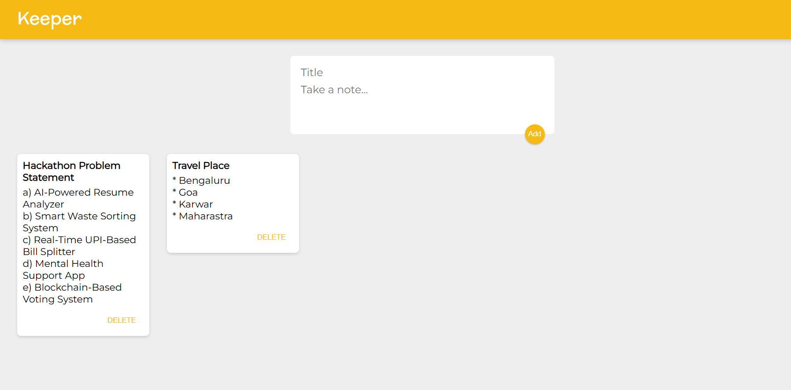

# 🗒️ Keeper App using React Hook

A clean and elegant **React.js application** that allows users to create, view, and delete notes dynamically — inspired by **Google Keep**.  
Built using **React**, **JavaScript (ES6)**, **HTML5**, and **CSS3**.

---

## 🖼️ Screenshots  

| 🗒️ Keeper App | 🗒️ Keeper App |
|------------|------------|
|  |  |

| 🗒️ Keeper App| 🗒️ Keeper App |
|---------------|---------------|
|  |  |

---

## 🛠️ Tech Stack
- ⚛️ **React.js**  
- 💻 **JavaScript (ES6)**  
- 🌐 **HTML5**  
- 🎨 **CSS3**  
- 🚀 **Vite / Create React App**

---

## 🧠 How It Works

1. ✏️ Add notes by entering a **title** and **content** in the input fields.  
2. 📄 View all notes displayed in **card format**.  
3. ❌ Delete notes anytime using the delete button.  
4. ⚡ Dynamic rendering using **React Hooks** for real-time updates.  

---

## ⚙️ Features

- 🧩 Add and delete notes seamlessly  
- ⚛️ Built with **Functional Components** and **React Hooks**  
- 💾 Real-time updates with **state management**  
- 🎨 Minimal and clean **UI design**  
- ⚡ Lightweight and fast performance  

---

## ⚛️ React Installation & Application Setup

### 📦 Installation

Install the required dependencies:
```bash
npm install
```

Launch your React project in your browser
```bash
npm run dev
```
 Open [http://localhost:3000](http://localhost:3000)
